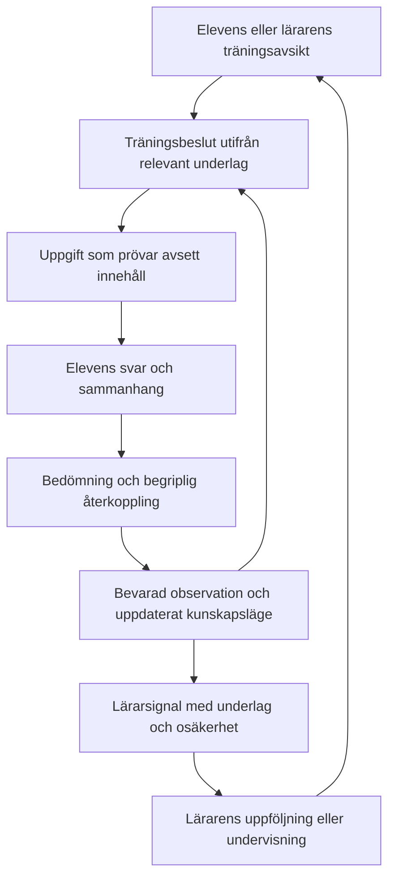

# Produktkontrakt — Sequential Math

Status: **antaget v1.0 av Simon, 2026-09-20**, efter granskning och beslut D1–D3.
Detta är avsedd produktfunktion, inte verifierat nuläge. Inga appfunktioner ändras av dokumentet.
Beslut och bakgrund: [granskningsunderlag](PRODUCT_CONTRACT_REVIEW.md). Observerbara exempel: [scenarier](PRODUCT_SCENARIOS.md). Underordnade regler: [funktionskontrakt F1–F6](FUNCTION_CONTRACTS.md).

## 1. Syfte och framgång

**M1 — Elevens lärande.** Appen ska ge meningsfull mängdträning som befäster kunskaper och successivt utvecklar dem genom anpassad utmaning. Eleven ska kunna börja och fortsätta med få hinder, få begriplig återkoppling och möta ett rimligt nästa steg.

**M2 — Lärarens undervisningsbeslut.** Samma träning ska ge läraren tillförlitligt, begripligt underlag om elevens kunnande, svårigheter och utveckling. Läraren ska kunna se vem som behöver uppföljning, inom vilket innehåll, varför och med vilket underlag.

M1 och M2 är två delar av samma uppdrag. Insamling får inte göra vardagsträningen till ett omärkligt prov; enkel elevnavigation får inte göra lärarunderlaget missvisande. Appen stödjer undervisning och professionell bedömning, men är inte ensam grund för diagnos, betyg eller påståenden om allmän matematikförmåga.

Framgång bedöms genom meningsfulla elevförlopp och användbara lärarbeslut. Antal svar, sviter, hög rättprocent, stigande nivånummer och gröna tester är indikatorer eller kontrollresultat, inte tillräckliga bevis för lärande. Ett enskilt klasspass kan ge stöd eller motexempel för ett beteende, inte bevisa långsiktig lärandeeffekt.

## 2. Principer som styr underordnade beslut

| ID | Princip | Konsekvens för alla funktioner |
| --- | --- | --- |
| P1 | Innehåll före nivånummer | Varje kompetens och steg har ett uttryckligt matematiskt mål. Samma nivånummer i olika områden betyder inte likvärdig förmåga. |
| P2 | Anpassning med riktning | Träningen ska kunna befästa, utmana och återhämta. Fler eller större tal är inte i sig progression. Ihållande svårighet och stabilt kunnande måste kunna leda till olika nästa steg. |
| P3 | Relevant och tillräcklig evidens | Endast svar som faktiskt prövar en kompetens får belägga den. Variation, hjälp och träningsläge ingår i tolkningen. Okänt kunnande är inte konstaterad kunskapsbrist. |
| P4 | Observation före tolkning | Elevens svar och uppgiftens sammanhang skiljs från systemets bedömning, felhypotes och rekommendation. En matchande felmodell är en hypotes, inte en säker förklaring. |
| P5 | Gemensam betydelse i hela flödet | Elevvy, progression, lärarvy och export bygger på samma definitioner och identifierbara observationer. Sammanfattningar får skilja sig i detalj, inte i innebörd för samma urval. |
| P6 | Anpassning ska synas i analysen | Rättprocent och svarstid tolkas med innehåll, svårighet, urval och period. Svårare uppgifter kan ge fler fel trots utvecklat kunnande. |
| P7 | Begriplig kontroll | Val av fokus och lärarens ramar har definierade konsekvenser. Svårigheten anpassas automatiskt inom ramen, utan elevens godkännande av avancering. Ett valt eller tilldelat fokus får inte tyst ersättas av ett annat. |
| P8 | Kontinuitet och tydlig osäkerhet | Svar får inte tyst tappas, dubbelräknas eller byta betydelse. Begränsad, gammal eller ännu inte tillgänglig information markeras innan den används för starka slutsatser. |
| P9 | Användbar och skonsam träning | Inmatning, tempo, avbrott och tekniska fel får inte utan stöd tolkas som matematiska svårigheter. Snabbhet är inte ett generellt villkor för avancering. |

Tidigare nämnda cirka 85 procent rätt är en designhypotes för lämplig utmaning, inte ett universellt elevkrav eller samma sak som tröskeln för befäst kunskap. Exakta trösklar, observationsfönster och nivåblandningar hör till versionshanterade underkontrakt och måste motiveras mot M1/M2.

## 3. Gemensamt språk

- **Träningsfokus:** vad eleven eller läraren valt att arbeta med; kan innehålla flera kompetenser.
- **Kompetens:** den matematiska förmåga ett visst underlag faktiskt belyser.
- **Steg/nivå:** en beskriven progression inom en kompetens, med angivna förkunskaper och variation.
- **Observation:** en uppgift som eleven mött, elevens svar och känt sammanhang, såsom läge, hjälp och avbrott.
- **Bedömning:** regelstyrd tolkning av svaret, inklusive fullständighet och eventuell felhypotes.
- **Uppnått kunnande:** vad tidigare underlag har belagt inom ett definierat innehåll och en regelversion; inte ett löfte om oföränderlig förmåga.
- **Aktuellt träningsbehov:** vad eleven behöver möta nu. Kan vara repetition av tidigare uppnått kunnande.
- **Lärarsignal:** en spårbar sammanfattning eller hypotes med underlag, begränsningar och möjlig uppföljning.

Synlig rubrik, kompetens, prestation, aktivitet och felhypotes får inte användas som utbytbara begrepp. Detta kontrakt föreskriver ännu inga fältnamn eller databasformat.

## 4. Helhetsflöde och funktionellt ansvar

Detta är funktionellt ansvar, inte ett krav på synkrona nätverksanrop mellan stegen. Lagring, identitet och åtkomst stödjer hela kedjan och måste bevara dess betydelse även vid avbrott.

| ID / ansvar | Ska leverera | Får inte tyst besluta |
| --- | --- | --- |
| F1 Träningsavsikt | Entydigt läge, fokus, tillåtna val och eventuella lärarbegränsningar. | Vilken kompetens ett svar belägger enbart från menynamnet. |
| F2 Träningsbeslut | Ett motiverat nästa steg: introduktion, befästande, utmaning, återhämtning eller stödbehov. | Ny pedagogisk policy i en UI-knapp eller en generator. |
| F3 Uppgiftsinnehåll | Korrekt, besvarbar uppgift med avsett mål, variation och svarskrav. | Byta kompetens eller svårighet utan att träningsbeslut och evidens följer med. |
| F4 Svar och återkoppling | Observation, konsekvent bedömning och begriplig respons; skilj ofullständigt svar från fullständigt rätt när formen ingår i målet. | Säker diagnos av orsaken från ett ensamt svar. |
| F5 Kunskapsläge och kontinuitet | Samma innebörd efter registrering, återläsning och sammanställning; separerat historiskt kunnande och aktuellt behov. | Dubblera observationer, tyst omtolka historik eller dra slutsatser av saknat underlag. |
| F6 Lärarunderlag | Innehåll, period, omfattning, sammanhang, signal och möjlig uppföljning. | Likställa låg aktivitet, låg snabbhet och låg matematisk förmåga. |

### Antagna pedagogiska beslut

- **D1 — Automatisk progression, bekräftelse i efterhand.** Appen anpassar svårigheten och tar eleven vidare när relevant underlag motiverar det, inom träningsramen. Eleven ska inte välja mellan att stanna och att gå upp i svårighet. Övergången ska inte föregås av ett budskap om att nästa uppgifter är svårare. Eleven kan gratuleras efter att ha belagt kunnandet för en nivå eller ett område; bekräftelsen ska avse just det innehållet och inte kräva ett val för fortsatt progression. Kriterierna för sådan bekräftelse preciseras i underkontrakt. Beslutet tar inte bort tillåtna fokusval, stöd eller paus och innebär inte ett generellt förbud mot nivåöversikter.
- **D2 — Historik och aktuellt behov hålls isär.** Bevara vad tidigare underlag belagt och visa aktuellt repetitions-/stödbehov separat. Tidigare framsteg får inte hindra anpassning nedåt och skrivs inte över av den.
- **D3 — Lärarens ram respekteras.** Appen lämnar inte tyst ett uttryckligen låst innehåll eller en låst nivå. Om eleven fastnar erbjuds tillgängligt stöd eller paus och läraren får en signal. Adaptiva uppdrag medger återhämtning inom angiven ram.

Gränser mellan träningslägen ska preciseras i ett underkontrakt: fri träning anpassas inom aktiverat innehåll; områdesfokus inom valt område; låst nivå respekteras; tabellövning och diagnostiska uppdrag har uttryckliga egna syften. Alla lägen omfattas av P3–P8. Tickets får inte automatiskt räknas som vanlig träning.

## 5. Kontrakt för underkontrakten

Följande produktmässiga rangordning gäller:

1. Detta kontrakts mål och principer.
2. Uttryckligen antagna pedagogiska beslut som preciserar kontraktet.
3. Funktionskontrakt för F1–F6 och ämnesspecifika innehållskontrakt.
4. Teknisk arkitektur, datakontrakt och implementation.
5. Manualer och daterade verifieringsrapporter.

Agenters verktygs-/behörighetsregler påverkas inte. Simon fastställer mål och pedagogiska avvägningar. En agent får föreslå och implementera inom godkänd riktning, men inte ändra högre nivå för att legitimera en enklare lokal lösning. Motsägelser registreras och avgörs på den nivå där avvägningen hör hemma.

Varje underkontrakt ska innehålla: ID och status; berörda M/P/F-ID:n; syfte och gräns; begrepp och ansvar; normalt beteende och undantag; observerbara acceptansscenarier; verifieringsmetod; regelversion och hantering av befintligt underlag. Exakta tekniska detaljer läggs endast där de behövs.

Varje betydande ändring ska visa kedjan **mål → princip → funktionskrav → ändring → bevis**. För en liten fix kan detta vara några rader i ändringsbeskrivningen. Ett funktionstest ska också kontrollera relevanta konsekvenser längre fram i kedjan, exempelvis elevsvar till lärarsignal.

En permanent regel får en auktoritativ definition; andra dokument länkar till den. Kod beskriver vad appen gör. Antagna kontrakt beskriver vad den ska göra. Vid skillnad rättas felet eller fattas ett uttryckligt nytt beslut; produktkravet skrivs inte om enbart för att passa befintlig kod.

## 6. Vad ”klart” betyder

Två statusar ska hållas isär:

- **Beslut:** föreslaget → antaget → ersatt, med datum och beslutsfattare.
- **Leverans:** ej kartlagt → avvikelse/saknas → implementerat → verifierat i angiven miljö. Publicerad version redovisas separat.

Ett godkänt dokument bevisar inte funktion. Ett godkänt test bevisar bara det som testet täcker. För varje påstående om verifiering anges scenario, version, miljö, metod, utfall och kvarvarande begränsning. Berörda elev- och lärarflöden behöver båda granskas.

En föreslagen ”guardian” består av flera kontroller: kontraktskontroll vid körning, oberoende innehållskontroller, återspelbara elevförlopp före publicering och observation av verklig användning. Den får inte själv uppfinna pedagogiska regler. Vid ett kontraktsbrott ska felaktig uppgift eller osäkert underlag inte tyst användas som giltig kunskapsevidens; exakt återhämtning och kommunikation specificeras i underkontrakt.

## 7. Avgränsning

Kontraktet väljer inte nya trösklar, nya ämnen, ett nytt tekniskt ramverk, en ny databas eller en ny elevmeny. Det implementerar inte en guardian och certifierar inte nuvarande app. Nästa steg är att kartlägga funktionerna mot kontraktet och därefter planera sammanhängande implementation och verifiering.
