# Dataflöde & Logik — Sequential Math

## 1. Övergripande systemarkitektur

```mermaid
graph TB
    subgraph "Klient (React SPA)"
        SH[StudentHome.jsx]
        SS[StudentSession.jsx]
        ST[StudentTicket.jsx]
        TD[Dashboard.jsx<br/>Lärare]
    end

    subgraph "Lib-lager"
        DA[difficultyAdapter.js<br/>Problemval + svårighetsjustering]
        PG[problemGenerator.js<br/>Templategenerering]
        SP[studentProfile.js<br/>Profil + resultatregistrering]
        ST2[storage.js<br/>localStorage + molnsync]
        TL[telemetry.js<br/>Händelser + dagliga mätvärden]
        PR[studentPresence.js<br/>Närvaro + engagemang]
        TK[tickets.js<br/>Ticket-system]
        PM[progressionModes.js<br/>Lugn / Utmaning]
    end

    subgraph "Templates"
        AT[additionTemplates.js<br/>12 nivåer]
        SBT[subtractionTemplates.js<br/>12 nivåer]
        MT[multiplicationTemplates.js<br/>12 nivåer]
        DT[divisionTemplates.js<br/>12 nivåer]
    end

    subgraph "Server (Vercel)"
        API1[/api/students<br/>GET alla profiler]
        API2[/api/student/:id<br/>GET/POST + merge]
        API3[/api/teacher-auth<br/>Lösenord + token]
        KV[(Vercel KV<br/>Redis)]
    end

    SS --> DA
    DA --> PG
    PG --> AT & SBT & MT & DT
    SS --> SP
    SP --> ST2
    ST2 -->|localStorage| SH
    ST2 -->|Cloud sync| API2
    API2 --> KV
    TD --> API1
    TD --> API3
    SS --> TL
    SS --> PR
    SH --> TK
    ST --> TK
```

---

## 2. Elevprofil — datastruktur

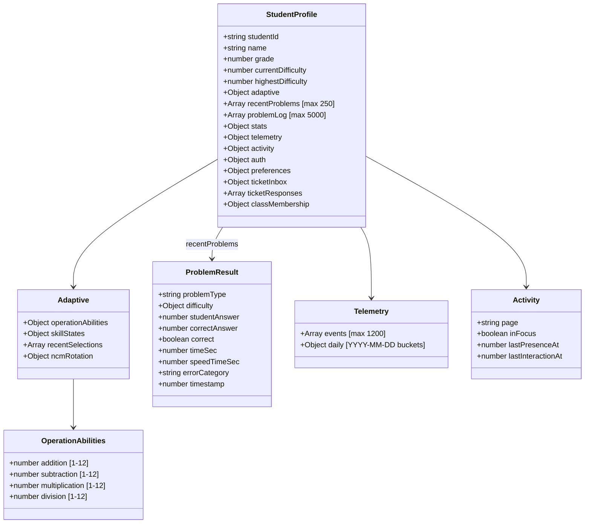

---

## 3. Problemval — fullständigt flöde

```mermaid
flowchart TD
    Start([Elev klickar Starta]) --> ParseURL[Parsa URL-parametrar<br/>mode / level / tables / pace / assignment]
    ParseURL --> Rules[getSessionRules]

    Rules --> IsNCM{NCM-uppdrag?}
    IsNCM -->|Ja| NCM[filterNcmProblems + generateNcmProblem]
    IsNCM -->|Nej| IsTable{Tabellträning?}
    IsTable -->|Ja| TableDrill[generateMultiplicationTableDrillProblem]
    IsTable -->|Nej| IsLevelFocus{Nivåfokus?<br/>mode + level satt}
    IsLevelFocus -->|Ja| Forced[forcedLevel = level<br/>forcedType = mode<br/>levelRange = level..level]
    IsLevelFocus -->|Nej| FreeSelect[Fri val]

    FreeSelect --> SelectOp

    subgraph SelectOp [Välj räknesätt]
        direction TB
        Guard1{errors >= 2 ELLER<br/>success < 65%?}
        Guard1 -->|Ja| RetAdd1[return addition]
        Guard1 -->|Nej| Guard2{attempts < 10 ELLER<br/>difficulty < 3.5?}
        Guard2 -->|Ja| RetAdd2[return addition]
        Guard2 -->|Nej| WeightedPick[Viktad slump:<br/>addition 60%<br/>subtraction 25% om diff>=4<br/>multiplication 15% om diff>=5<br/>division 10% om diff>=7]
    end

    SelectOp --> GetAbility[Hämta operationAbility<br/>för valt räknesätt]
    GetAbility --> IntroCheck{Nytt räknesätt?<br/>Mjuk introduktion}

    subgraph IntroCheck [Introduktionsramp]
        direction TB
        IC1{opAttempts < 3?}
        IC1 -->|Ja| Cap1[Max nivå 1]
        IC1 -->|Nej| IC2{opAttempts < 6?}
        IC2 -->|Ja| Cap2[Max nivå 2]
        IC2 -->|Nej| IC3{opAttempts < 12?}
        IC3 -->|Ja| Cap3[Max nivå 3]
        IC3 -->|Nej| NoCap[Ingen begränsning]
    end

    IntroCheck --> CheckWarmup{Frånvaro-warmup?<br/>daysAway >= 1}
    CheckWarmup -->|Ja| Warmup[Lättare nivå<br/>roundedDiff - 1 eller -2]
    CheckWarmup -->|Nej| CheckErrors{3+ fel i rad?}
    CheckErrors -->|Ja| EasyWin[roundedDiff - 1]
    CheckErrors -->|Nej| CheckPush{success > 92%<br/>och >= 6 problem?}
    CheckPush -->|Ja| Push[roundedDiff + 1]
    CheckPush -->|Nej| CheckRelief{success < 55%<br/>och >= 6 problem?}
    CheckRelief -->|Ja| Relief[roundedDiff - 1]
    CheckRelief -->|Nej| CheckBootstrap{Nivå 1 och<br/>success >= 60%<br/>och >= 8 problem?}
    CheckBootstrap -->|Ja, 30% chans| Boot[Nivå 2]
    CheckBootstrap -->|Nej| Bucket

    subgraph Bucket [Svårighetsbucket - viktad slump]
        direction LR
        B1["very_easy (-2) 5%"]
        B2["easy (-1) 25%"]
        B3["core (0) 50%"]
        B4["hard (+1) 15%"]
        B5["challenge (+2) 5%"]
    end

    Warmup & EasyWin & Push & Relief & Boot & Bucket --> TargetLevel[targetLevel = roundedDiff + offset]
    Forced --> TargetLevel
    TargetLevel --> Generate

    subgraph Generate [Generera problem]
        direction TB
        G1[Filtrera templates:<br/>conceptual_level == targetLevel]
        G1 --> G2{Finns preferred type<br/>på exakt nivå?}
        G2 -->|Ja| G3[Slumpa bland preferred-type templates]
        G2 -->|Nej| G4{Finns NÅGON template<br/>på exakt nivå?}
        G4 -->|Ja| G5[Slumpa bland alla typer]
        G4 -->|Nej| G6[Fallback: närmaste nivå<br/>samma typ om möjligt]
        G3 & G5 & G6 --> G7[generateProblem: slumpa a,b<br/>inom constraints<br/>validera resultat]
    end

    Generate --> Display([Visa problem för eleven])
```

---

## 4. Svårighetsjustering efter varje svar

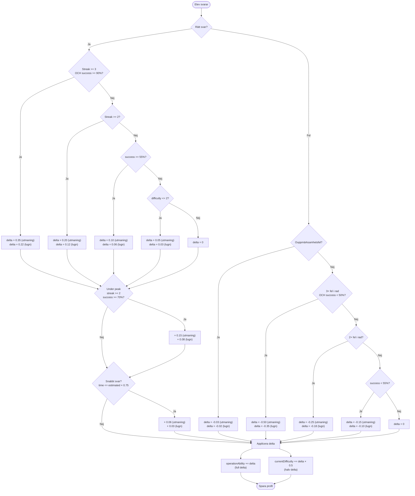

---

## 5. Operationsintroduktion

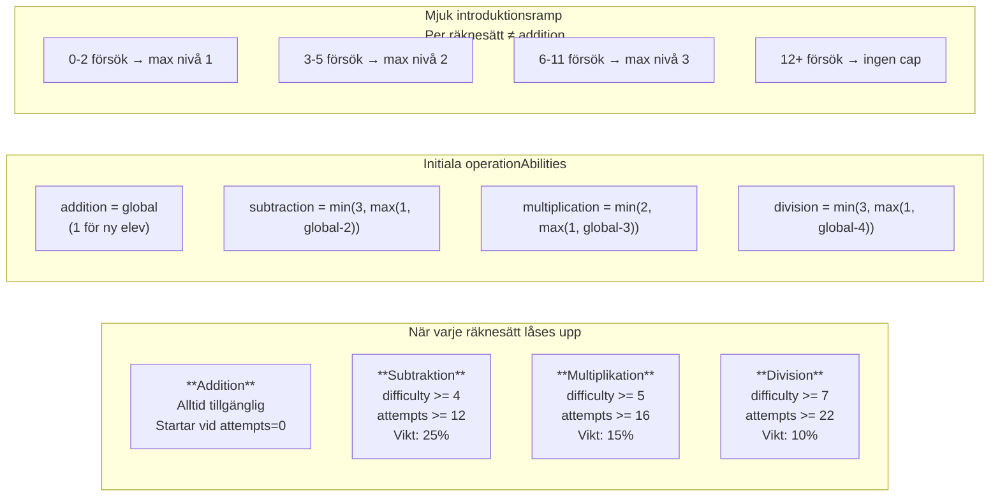

---

## 6. Lagring & synkronisering

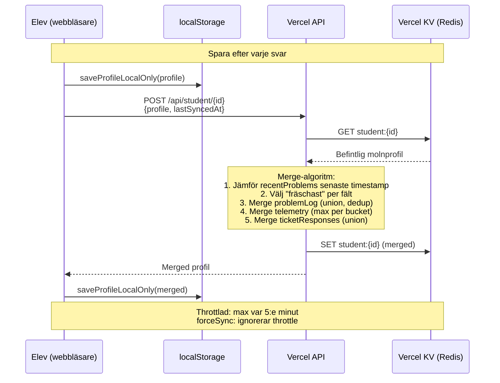

---

## 7. Lärardashboard — datakällor

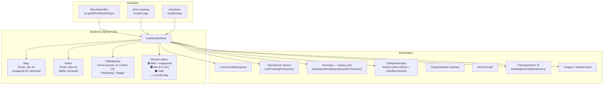

---

## 8. Träningsprioritet — algoritm

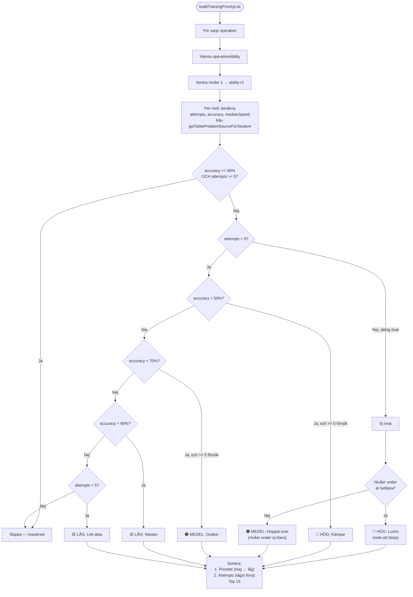

---

## 9. Ticket-flöde

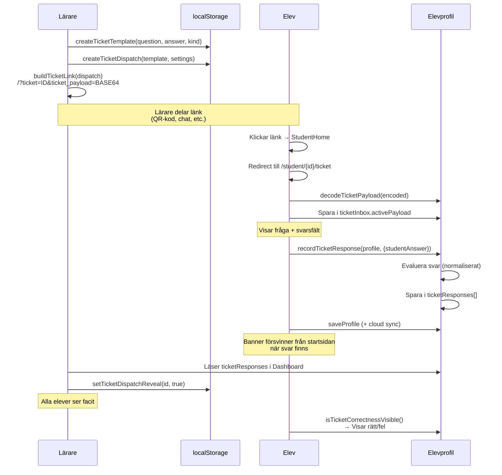

---

## 10. Närvaro & engagemangsspårning

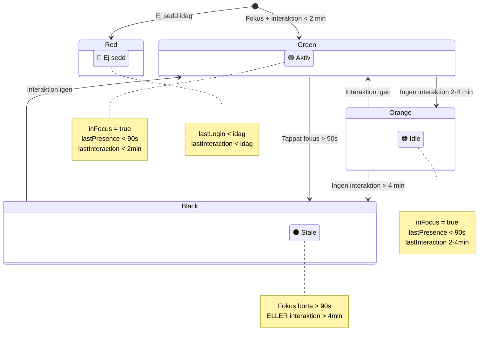

---

## 11. Sessionsflöde — från start till slut

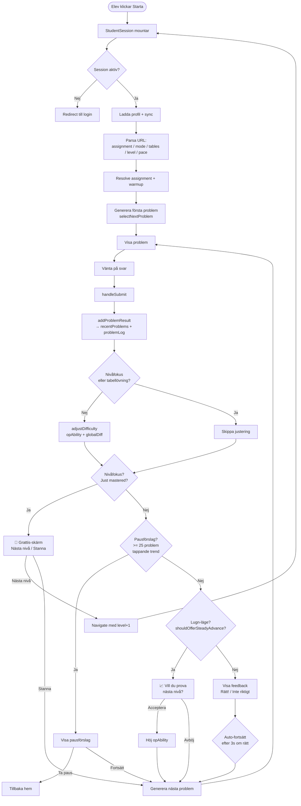

---

## 12. Template-nivåer — vad varje nivå innehåller

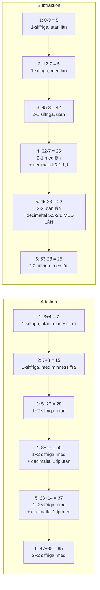

> Nivå 7-12 följer samma mönster med 3-siffriga tal och 2-decimalers precision.

---

## 13. Progressionslägen — Utmaning vs Lugn

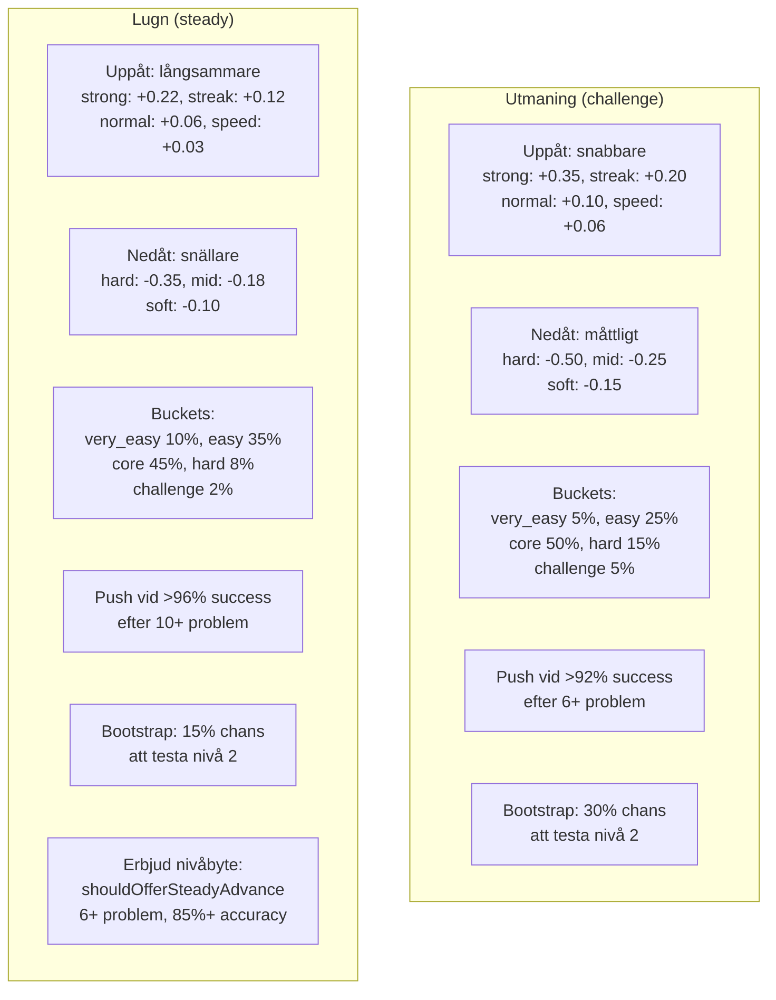
